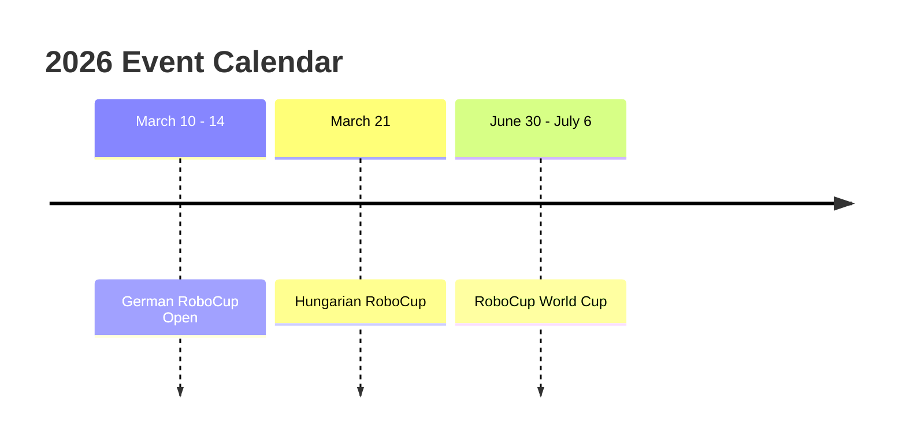

<h1 align="center">noon</h1>

# Who are we?
We are a youth RoboCup team representing Hungary in the Humanoid KidSize category. Our team has six members ranging from high school students to university students. You can read more about us on our [website](https://www.no-on.hu). We also have a [YouTube channel](https://www.youtube.com/@team-noon) where we upload short videos about our progress.

# Contact
You can contact us by email at [team@no-on.hu](mailto:team@no-on.hu) or [robocup.noon@gmail.com](mailto:robocup.noon@gmail.com)
